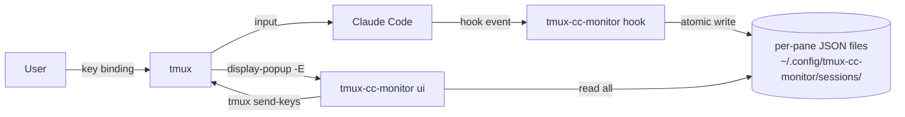

# tmux-cc-monitor Design Doc

| 項目 | 内容 |
|---|---|
| Author | ch0wdreN |
| Reviewer | セルフレビュー |
| Status | Draft |
| Target Version | v0.0.1 (初期リリース。機能改善・hook 仕様の追加調査余地を含む段階) |
| Created | 2026-05-06 |
| Updated | 2026-05-06 |

---

## 1. 概要 (Overview)

tmux 上で並列に動いている複数の Claude Code セッションを、現在の作業ペインから離れずに横断把握・操作するためのローカルツール。Claude Code の hooks が発火するたびに per-pane の状態ファイルを更新し、tmux popup 上で起動する bubbletea TUI からセッション一覧を表示・選択して `tmux send-keys` でプロンプトを送信する。送信後は popup を閉じれば元のペインへ自動的に戻る。

## 2. 背景と目的 (Background & Motivation)

複数プロジェクトを並列で開発していると、tmux のセッション/ウィンドウを跨いで Claude Code を多重起動することになる。このとき次の問題が生じる:

- **セッション移動コスト**: ウィンドウ数が増えるほど目的のペインに辿り着くのが面倒で認知負荷が高い。
- **permission 待ちの見落とし**: 別セッションで permission プロンプトに止まっていることに気付かず、放置されることがある。
- **作業流の中断**: プロンプトを 1 行送りたいだけで、大きなコンテキスト切り替え (セッション → ウィンドウ → ペイン → 入力 → 元のペインに戻る) が必要になる。

これらをまとめて解決するために、現在のペインから 1 アクションで「全 Claude Code セッションの状態確認 → 必要なものへ送信 → 元の作業に戻る」という体験を提供する。

## 3. スコープ (Scope)

### In Scope

- Claude Code hooks に処理を仕込み、per-pane の状態 JSON を更新する hook ハンドラ
- tmux popup 上で動作する bubbletea ベースの TUI
- TUI 上で対象セッションを選択し、`tmux send-keys` でプロンプトを送信する機能
- popup 起動時のステイル状態ファイル除去（生存しない pane と異なる tmux サーバ世代の JSON を削除）
- tmux 外起動時には状態ファイルを作成しないガード（`$TMUX` 環境変数による判定）
- hook 設定スニペット（Claude Code `~/.claude/settings.json` への追記用）の同梱
- macOS のみのサポート

### Out of Scope

- バックグラウンド常駐プロセス（v0.0.1 では起動しない。将来 status-line 通知などを足す段で別途検討）
- status-line 表示や OS 通知などの能動的な「待ち通知」
- permission UI 用の専用ショートカット（`y`/`n` などで Allow/Deny を即送信する機能）— v0.0.1 では `enter` → 自由テキスト送信のみ
- 送信履歴管理・テンプレート集
- Claude Code 以外の TUI セッション監視
- macOS 以外の OS 対応
- チーム配布、複数ユーザー運用

## 4. 制約条件 (Constraints)

| 種別 | 内容 |
|---|---|
| 技術的制約 | Go 1.26.1、bubbletea、tmux 3.2 以上（popup 機能が必要） |
| OS | macOS のみ（作者の利用環境） |
| 外部依存 | Claude Code 本体の hooks 仕様に依存。仕様変更があれば追従が必要 |
| 期限 | なし（個人プロジェクト、緩く進める） |
| 予算 | なし |
| コンプライアンス | なし（ローカル個人ツール） |
| 組織的制約 | 単独開発、レビュアーなし |

## 5. 受け入れ基準 (Acceptance Criteria)

すべて手動またはコマンドで再現可能な形で記述する。

- [ ] **基本送信フロー**: 2 つ以上の Claude Code セッションが並列で動作している状態で、現在のペインから tmux のキーバインド 1 つで popup を起動できる
- [ ] **分割表示**: popup 上で「permission 待ち」セクションと「停止/idle」セクションが分割表示され、各セッションの pane id・プロジェクト名（cwd basename）・最終イベント時刻が確認できる
- [ ] **送信成功**: popup 上で対象セッションを選択し、自由テキストを入力して enter を押すと、対象 pane に文字列＋改行が欠損なく送信される
- [ ] **送信頑健性**: 100 文字超のテキスト、改行を含むテキスト、日本語混在のテキストを送って、対象 pane の入力欄に欠損・順序逆転なく届くこと（手動確認）
- [ ] **キャンセル**: popup を閉じると（既定キーは `q` または `esc`、tmux 設定で上書き可）呼び出し元のペインに自動で戻る
- [ ] **tmux 外ガード**: tmux 外で Claude Code を起動した場合、hook が発火しても状態ファイルが作成されない
- [ ] **ステイル除去 (pane クローズ)**: pane が閉じられた後に popup を起動すると、対応する状態ファイルが削除される
- [ ] **ステイル除去 (kill-server)**: `tmux kill-server` 後に再度 tmux と Claude Code を起動して popup を開くと、過去のサーバ世代の状態ファイルが除去される
- [ ] **誤分類防止**: permission 待ち以外の `Notification`（idle 通知等）が popup の「permission 待ち」セクションに紛れない
- [ ] **観測性**: hook の書き込み失敗が `~/.config/tmux-cc-monitor/hook-errors.log` に追記され、`tmux-cc-monitor ui` 起動時に直近のエラー件数がフッタに表示される
- [ ] **ビルド確認**: macOS + tmux 3.2+ + Go 1.26.1 でビルド・実行できる

## 6. システム設計 (System Design)

### 6.1 アーキテクチャ概要



データフローはシンプルに「hook が write、popup が read」で完結する。両者の間に常駐プロセスは存在しない。送信は必ず tmux を経由するため、図でも tmux を中継として明示している。

### 6.2 コンポーネント説明

| コンポーネント | 役割 |
|---|---|
| `tmux-cc-monitor hook <event>` | Claude Code の各 hook から呼ばれる。Claude Code が渡す引数 / 環境変数（`$TMUX`, `$TMUX_PANE`, hook payload）を読み、対応する状態 JSON を atomic に更新する小さな Go バイナリ |
| 状態ファイル群 (`sessions/<pane_id>.json`) | per-pane の最新状態を保持する単一ファイル。書き込みパスが pane ごとに分離されるため書き込み競合が構造的に発生しない |
| エラーログ (`hook-errors.log`) | hook 側の write 失敗・引数不整合・JSON エンコード失敗などを追記する観測用ログ。`tmux-cc-monitor ui` がフッタで件数表示する |
| `tmux-cc-monitor ui` | tmux popup から起動される bubbletea アプリ。状態ファイル群を読み込み、UI を提示し、`tmux send-keys` を実行する |
| cleanup ロジック | popup 起動時に `tmux list-panes -a -F '#{pane_id}'` および現在の tmux サーバ pid と状態ファイル群を突き合わせ、生存しない pane / 異なるサーバ世代の JSON を削除する |

### 6.3 tmux キーバインド設定例

ユーザーは `~/.tmux.conf` に以下を追加して popup を呼び出す:

```tmux
bind C-g display-popup -E -w 80% -h 80% 'tmux-cc-monitor ui'
```

`-E` を付けることで popup 内プロセスの終了に合わせて popup が自動で閉じる。終了キー（`q` / `esc` 等）は bubbletea 側で受ける。

### 6.4 Claude Code hook 設定スニペット

`~/.claude/settings.json` の `hooks` に以下を追記する。Claude Code の現行 hook スキーマは各イベントの値を `[{ matcher, hooks: [...] }]` の入れ子で受ける（`matcher` を空文字列にすると全マッチ、tool 名等を入れて絞ることも可能）:

```json
{
  "hooks": {
    "UserPromptSubmit": [
      { "matcher": "", "hooks": [{ "type": "command", "command": "tmux-cc-monitor hook UserPromptSubmit" }] }
    ],
    "Notification": [
      { "matcher": "", "hooks": [{ "type": "command", "command": "tmux-cc-monitor hook Notification" }] }
    ],
    "Stop": [
      { "matcher": "", "hooks": [{ "type": "command", "command": "tmux-cc-monitor hook Stop" }] }
    ]
  }
}
```

スニペットは v0.0.1 の README に同梱する。`install-hooks` のような自動追記サブコマンドは v0.0.1 以降のバージョン。

hook 起動の仕様（実機確認済み, 2026-05-06）:

- 各 hook は shell subprocess として起動され、JSON payload は **stdin** から渡される（argv ではない）
- 共通 payload フィールド: `session_id` / `transcript_path` / `cwd` / `permission_mode` / `hook_event_name`
- イベント別の追加フィールド:
  - `UserPromptSubmit`: `prompt`（送信されたユーザー入力）
  - `Notification`: `notification_type` / `tool_name` / `tool_input`
  - `Stop`: 追加フィールドなし
- `$TMUX` および `$TMUX_PANE` は親プロセスから子へ継承される（tmux 内で起動された Claude Code から hook 子プロセスへ自動伝播）

## 7. API設計 (API Design)

該当なし。CLI ツールであり、外部 API は提供しない。CLI サブコマンドのみ存在する:

| サブコマンド | 用途 |
|---|---|
| `tmux-cc-monitor hook <event-name>` | Claude Code の hooks 設定から呼ばれる内部用 |
| `tmux-cc-monitor ui` | tmux popup から呼ばれて TUI を起動 |

## 8. データ設計 (Data Design)

### 8.1 スキーマ

状態ファイルは `~/.config/tmux-cc-monitor/sessions/<pane_id>.json` に 1 ペイン 1 ファイルで保存する。`pane_id` は tmux の `%42` のような ID。ファイル名としては先頭の `%` を除いた数値 (`42.json`) を使う。

```json
{
  "schema_version": 1,
  "tmux_server_pid": 78901,
  "pane_id": "%42",
  "session": "work",
  "window_index": 1,
  "window_name": "api",
  "cwd": "/Users/.../proj-foo",
  "status": "waiting_permission",
  "last_event": "Notification",
  "last_message": "Allow command: curl ...",
  "raw_payload": { "...": "Claude Code から渡される hook payload を保持" },
  "updated_at": "2026-05-06T10:23:00Z"
}
```

| フィールド | 型 | 説明 |
|---|---|---|
| `schema_version` | int | スキーマ世代。UI 起動時に未知の値はスキップ＋警告 |
| `tmux_server_pid` | int | hook 発火時の tmux サーバ pid。`%N` の世代識別に用いる |
| `pane_id` | string | tmux pane id (`%NN`) |
| `session` | string | tmux session 名 |
| `window_index` | int | tmux window 番号 |
| `window_name` | string | tmux window 名 |
| `cwd` | string | hook payload か `os.Getwd()` 由来の作業ディレクトリ |
| `status` | enum | `running` / `waiting_permission` / `waiting_other` / `idle` のいずれか |
| `last_event` | string | 最後に発火した hook 名 (`Notification`, `UserPromptSubmit`, `Stop` 等) |
| `last_message` | string | popup 表示用の短い人間可読テキスト。`raw_payload` から抽出 |
| `raw_payload` | object | Claude Code から渡された hook 引数の生データ。将来の判定ロジック改善に備えて残す |
| `updated_at` | RFC3339 | 最終更新時刻 |

`pid` フィールド（Claude Code プロセス pid）は v0.0.1 では持たない。ステイル判定は `tmux list-panes` + `tmux_server_pid` で完結し、Claude Code pid を必要としないため。

### 8.2 データフロー

```
1. ユーザー、tmux 内で Claude Code を起動
2. Claude Code が hook (UserPromptSubmit / Notification / Stop) を発火
3. tmux-cc-monitor hook が呼ばれる
   3a. $TMUX が空なら何もせず終了 (tmux 外)
   3b. cwd を hook payload の `cwd` フィールドから取得（共通フィールドとして必ず存在）。欠落時のみ `os.Getwd()` フォールバック
   3c. tmux_server_pid を tmux display-message -p '#{pid}' で取得
   3d. Notification の場合は payload を見て waiting_permission / waiting_other を判定
   3e. <pane_id>.json を atomic write (tmpfile + rename)。失敗時は hook-errors.log に append し exit 1
4. ユーザー、別ペインで作業中にキーバインドを押す
5. tmux popup が tmux-cc-monitor ui を起動
6. UI が cleanup を実施
   6a. 現在の tmux_server_pid を取得
   6b. tmux list-panes -a -F '#{pane_id}' で生存 pane id を取得
   6c. 各状態ファイルについて、(server_pid 不一致) もしくは (pane_id が生存しない AND mtime が N 秒以上前) なら削除
7. UI が sessions/ ディレクトリ全件を並列で読み込む
   7a. 未知の schema_version は警告して除外
8. UI が status 別 (waiting_permission → waiting_other → idle / running) にグルーピング表示
9. ユーザー、対象を選択 → 入力 → enter
10. UI が `tmux send-keys -t <pane_id> -l '<text>' Enter` を 1 コマンドで実行
    - 大量テキスト時は `tmux load-buffer - && tmux paste-buffer -t <pane_id> -p` + `send-keys Enter` にフォールバック
11. UI 終了 → tmux popup 自動クローズ → 呼び出し元ペインに戻る
```

### 8.3 hook イベントと状態遷移

| hook | 発火タイミング | 遷移後の status | 補足 |
|---|---|---|---|
| `UserPromptSubmit` | ユーザーがプロンプト送信直後 | `running` | — |
| `Notification` (`notification_type` = `permission_prompt`) | permission 待ちの通知 | `waiting_permission` | `notification_type` フィールドの等価比較で判別。`tool_name` と `tool_input` から `<tool_name>: <tool_input compact JSON>` 形式の人間可読メッセージを `last_message` に格納 |
| `Notification` (`notification_type` がそれ以外) | `idle_prompt` / `auth_success` / `elicitation_*` などの通知 | `waiting_other` | UI 上で permission セクションには出さない。`last_message` には `notification_type` をそのまま記録 |
| `Stop` | 応答完了 | `idle` | — |

`status` は最後に発火した hook によって上書きされる単純なステートで、状態機械としての遷移制約は持たない。Claude Code 側のイベント順序を信頼する。

`notification_type` フィールドが Claude Code により提供されるため、文字列マッチではなく明示的な enum 値で判別する。`notification_type` の取りうる値は `permission_prompt` / `idle_prompt` / `auth_success` / `elicitation_dialog` / `elicitation_complete` / `elicitation_response`。`raw_payload` は将来の判定ロジック改善（例: `tool_input` をより詳細に分解した permission UX）に備えて保持し続ける。

### 8.4 cleanup の race 対策

cleanup 中に新規 pane の hook が走るレースを避けるため、削除条件は以下の AND とする:

1. 現在の `tmux list-panes -a -F '#{pane_id}'` に存在しない
2. `updated_at`（または mtime）が現在時刻から N 秒以上前（`N = 5` を初期値とする）

これにより「cleanup の `list-panes` 取得直後に新規 pane が hook を打って書き込んだ」ファイルは消されない。サーバ世代不一致のファイルは時刻条件を見ずに削除する。

## 9. エラーハンドリング (Error Handling)

| ケース | 動作 |
|---|---|
| `$TMUX` が空（tmux 外で hook 発火） | 即 exit 0、ファイル作成しない |
| 状態 JSON が破損している / 未知の `schema_version` | 当該ファイルをスキップして UI フッタに警告件数を出す |
| 対象 pane が UI 表示後に閉じられた | send-keys 失敗時、UI 上にエラーバナー表示し UI に戻る |
| `tmux` コマンド自体が利用不可 | UI 起動時にエラー表示して終了 |
| `sessions/` ディレクトリ不在 | hook 側で初回作成、UI 側は空一覧として表示 |
| 状態ファイルの atomic write 失敗 | `hook-errors.log` に時刻・pane_id・event・error を append し exit 1。stderr のみだと Claude Code 側で消えるため握り潰さない |
| `hook-errors.log` の肥大化 | 1MB 超過で `.log.1` にローテーションし新規ファイルから書き直す（最大 1 世代だけ保持） |

## 10. セキュリティ考慮事項 (Security Considerations)

ローカル個人ツールであり、共有マシン・他ユーザー利用は前提外。以下の最小限のみ:

- 状態ファイル・エラーログは `0600` で作成し、ホームディレクトリ配下に置く
- `tmux send-keys` には必ず `-l`（リテラル）モードを使い、tmux キー名や制御文字としての解釈を避ける

## 11. 設計上の意思決定 (Design Decisions)

### Decision 1: 状態管理は per-pane JSON ファイル方式

| | 内容 |
|---|---|
| **決定事項** | 各ペインの状態を `sessions/<pane_id>.json` として独立した 1 ファイルで保持する |
| **理由** | 書き込みパスがペインごとに分離されるため、複数 Claude Code が同時に hook を叩いても書き込み競合が原理的に発生しない。flock やトランザクション機構を実装する必要がなく、最小実装の方針に合致する |
| **検討した代替案** | (a) 単一 JSON ファイル `state.json` を flock で排他制御 (b) SQLite |
| **代替案を選ばなかった理由** | (a) は read-modify-write が毎回必要で非効率、flock 異常解放処理も必要。(b) は単一プロセスからの単一行更新が大半でトランザクションの利点が活きず、`cat` / `jq` でデバッグ可能な JSON テキストの方がメンテ性が高い |

### Decision 2: 常駐デーモンを置かず、popup 起動時にのみ動作する

| | 内容 |
|---|---|
| **決定事項** | バックグラウンドプロセスは持たず、hook と popup の 2 経路でのみプロセスが立ち上がる |
| **理由** | v0.0.1 の主用途は「ユーザーが popup を開いた瞬間に状態を見る」ことに絞られる。状態ファイルは hook 駆動で常時更新されており、popup 起動時に読み込めば十分。常駐させるとプロセス管理が必要となり最小実装の境界を越える |
| **検討した代替案** | (a) `fsnotify` で状態ファイルを watch する軽量デーモン (b) tmux `run-shell` を周期実行する疑似デーモン (c) launchd で定期起動して状態を集約 (d) tmux status-line 用の常駐デーモン |
| **代替案を選ばなかった理由** | (a)〜(d) いずれも「待ちが発生した瞬間の能動通知」を可能にするが、v0.0.1 ではユーザーが自発的に popup を開く前提のため不要。lifecycle 管理コストが現状の機能要件に対して過大 |

### Decision 3: 状態取得は Claude Code hooks に依拠し、`tmux capture-pane` でのポーリングはしない

| | 内容 |
|---|---|
| **決定事項** | Claude Code の `UserPromptSubmit` / `Notification` / `Stop` hooks に処理を仕込み、状態を能動的に通知させる |
| **理由** | hook はイベント駆動でリソース効率が良く、状態の意味（permission / 応答中 / idle）が明確。capture-pane ベースは UI 装飾・言語・改行差分で容易に破綻する |
| **検討した代替案** | `tmux capture-pane` を一定間隔でスナップショットし出力末尾の文字列パターンマッチで状態を推定 |
| **代替案を選ばなかった理由** | (1) 待ち判定が脆弱で誤検知/見逃しが発生 (2) 全 pane ポーリングの CPU/IO コストが線形に増加 (3) Claude Code 側の UI 装飾変更で破綻 (4) permission の構造化情報が取れず popup 表示の質が落ちる |

## 12. リスクと懸念事項 (Risks & Open Questions)

| リスク | 影響度 | 対応方針 |
|---|---|---|
| Claude Code の hooks 仕様変更（イベント名・引数・呼び出しタイミング） | High | ラッパー的位置付けゆえ仕様追従は不可避と割り切る。`raw_payload` を保持し、判定ロジックを後付けで差し替え可能にしておく |
| 同時セッション数が増えた場合の popup 起動レイテンシ劣化 | Med | 50 程度までは並列 read で十分速いと想定。100 を超えるユースケースが現実化したら、デーモン化と同時にインデックスファイル方式へ移行する余地を残す |
| hook バイナリの書き込み失敗が観測されない | Med | `hook-errors.log` への append + UI フッタでの件数表示で観測可能にする |
| permission タイムアウトの見落とし | Med | v0.0.1 は能動通知をしないため、ユーザーが定期的に popup を開く運用が前提。将来 status-line デーモンを足した段階で解消する |
| `tmux send-keys` の順序逆転・テキスト分割（IME / paste 検知の干渉含む） | Med | §8.2 step 10 の通り 1 コマンド送信に統一し、大量テキスト時は `paste-buffer` 経路にフォールバック。AC「送信頑健性」で実機確認 |
| `tmux kill-server` 後の `%N` 世代衝突によるファイル誤上書き / cleanup 漏れ | High | `tmux_server_pid` を状態ファイルに含め、cleanup で世代不一致を一律削除 |
| permission UI の選択肢に対する `y`/`n` ショートカット未実装 | Low | v0.0.1 以降のバージョン で詰める前提（送信内容の決定が UI バリエーションに依存するため、実装しながら調整する想定） |

> ✅ 解消済み (2026-05-06): Claude Code 公式 hook ドキュメント (https://code.claude.com/docs/en/hooks) と probe-hook (`cmd/probe-hook`) による実機ダンプで仕様を確定。結果を §6.4 / §8.3 / ADR-0003 に反映済み。

## 13. 実装計画 (Implementation Plan)

| フェーズ | 内容 | 状態 |
|---|---|---|
| 0. hook 仕様の実機調査 | Claude Code の hook payload・環境変数・cwd 引き渡し有無・呼び出しタイミングを実機確認 | ✅ 完了 (2026-05-06、公式ドキュメント + `cmd/probe-hook` で確認、結果を §6.4 / §8.3 / ADR-0003 に反映) |
| 1. プロトタイプ | hook バイナリと最小 bubbletea UI を疎通、`send-keys` 1 コマンド送信の頑健性を確認、ステイル除去（pane / kill-server）を実装 | ✅ 完了 (2026-05-06) |
| 2. UI 仕上げ | 分割表示・ソート・入力欄・大量テキスト時の `paste-buffer` フォールバック・hook-errors.log フッタ表示を実装 | ✅ 完了 (2026-05-06) |
| 3. v0.0.1 リリース | 受け入れ基準の項目をすべて満たした状態で個人運用開始 | ✅ 完了 (2026-05-06、PR #2) |
| 4. v0.0.1 以降のバージョン | permission ショートカット、status-line デーモン化を必要に応じて追加 | 未定 |

## 14. 参考資料 (References)

- Claude Code hooks: 公式ドキュメント (`UserPromptSubmit` / `Notification` / `Stop` 等の仕様)
- tmux popup: `tmux(1)` の `display-popup` セクション (tmux 3.2+)
- bubbletea: <https://github.com/charmbracelet/bubbletea>
- Go 1.26.1

### Related ADRs

- [状態管理に per-pane JSON ファイル方式を採用する](../adr/20260506-adopt-per-pane-json-state-files.md)
- [v0.0.1 ではバックグラウンド常駐デーモンを置かない](../adr/20260506-no-background-daemon-in-v0-0-1.md)
- [状態取得は Claude Code hooks に依拠し、tmux capture-pane でのポーリングはしない](../adr/20260506-use-claude-code-hooks-for-state.md)
