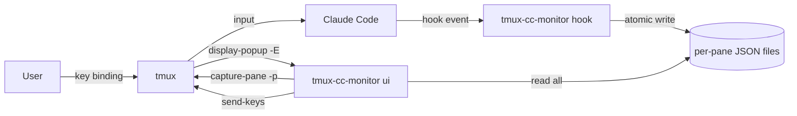
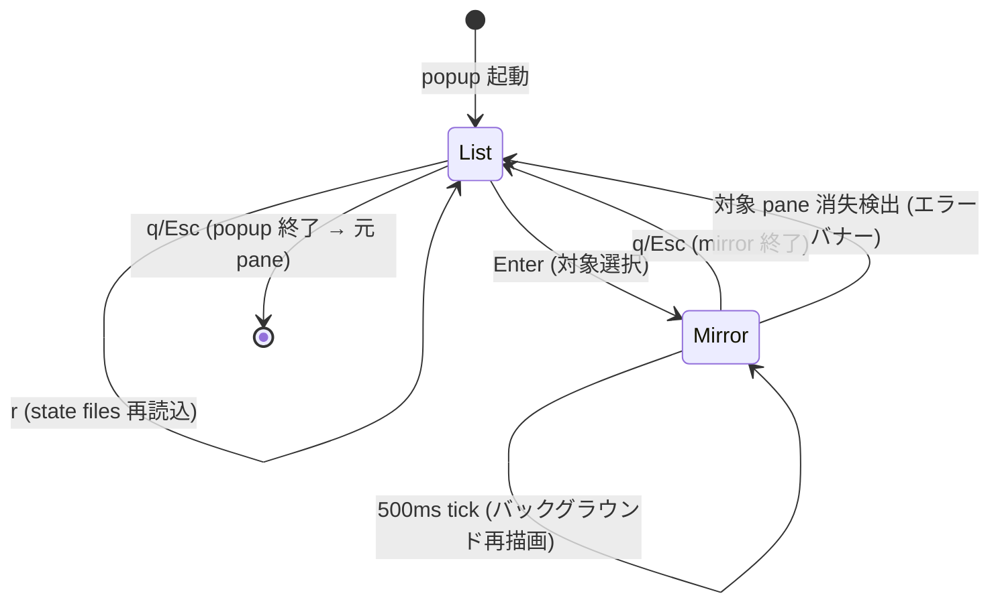

# tmux-cc-monitor popup mirror 機能 (v0.1.0) Design Doc

| 項目 | 内容 |
|---|---|
| Author | ch0wdreN |
| Reviewer | セルフレビュー |
| Status | Draft |
| Target Version | v0.1.0 (バージョン番号は仮置き、リリース時に確定) |
| Created | 2026-05-06 |
| Updated | 2026-05-06 |
| Related Design Doc | `docs/design-doc/20260506_tmux_cc_monitor_design.md` (v0.0.1) |

---

## 1. 概要 (Overview)

v0.0.1 で確立した「Claude Code hooks 駆動の per-pane JSON 状態 + tmux popup TUI」の上に、popup の中で対象 pane を **ミラー (capture-pane で描画 + send-keys でキー転送)** する 2 段構成を追加する。これにより popup を閉じずに対象 pane の生 TUI 状態 (permission の対象コマンド、AskUserQuestion の質問・選択肢、Claude Code の応答経過) を確認し、矢印・Enter・任意のキーで直接操作できる。popup を閉じれば元 pane に自動で戻り、元 pane の表示サイズ・フォーカスに副作用は生じない。

## 2. 背景と目的 (Background & Motivation)

v0.0.1 の UX の核は「対象 pane を選択して自由テキスト + Enter を送る」だった。実運用で次の問題が表面化した:

1. **直前状態を見ずには送るべき内容が決められない** — permission プロンプトの対象コマンド、AskUserQuestion の質問文と選択肢、直前の応答が見えないと、何を送るべきか判断できない。`last_message` 1 行では情報量が足りない。
2. **「割り込んで送って戻る」UX が未達成** — 結局ユーザーは現在の pane → 対象セッション/window/pane を辿る → 状態確認 → 入力 → 元 pane に戻る、を手動で回す羽目になり、popup の意義が薄れていた。
3. **AskUserQuestion 等の矢印選択 UI に応答できない** — v0.0.1 は自由テキスト + Enter のみ。AskUserQuestion のような矢印選択型 UI には popup から応答できなかった。

popup 内ミラーは、(1) 直前状態をそのまま見せる (2) popup 内で操作完結し閉じれば元 pane (3) 矢印・Enter・任意のキーを転送できる、を同時に解決する。

## 3. スコープ (Scope)

### In Scope
- popup の 2 段構成: list 画面 → 選択 → mirror 画面
- list 画面: 各セッションを `[status] pane_id project last_message(1行)` の形で一覧、`r` キーで state files 再読込
- mirror 画面: 対象 pane を `tmux capture-pane` で描画、bubbletea のキー入力を `tmux send-keys` 経由で転送
- mirror 描画戦略: (a) キー転送直後の即時更新 (b) 500ms 間隔のバックグラウンド再描画
- 退出フロー: mirror で `q`/`Esc` → list に戻る、もう 1 回 `q`/`Esc` → popup 終了 (元 pane へ)
- 対象 pane 消失検出と list へのフォールバック
- AskUserQuestion / permission / 自由 prompt 送信のいずれも mirror 上で同一フローで扱う

### Out of Scope
- permission の y/n 即時送信ショートカット (popup から飛ばずに送るパス)
- status-line / 通知デーモン化 (引き続き v0.1.0 以降のバージョン)
- 別 client / 別 tmux server サポート (同一 client/server 内で完結)
- capture-pane を state 判定に使う用途 (ADR-0003 維持)
- tmux attach-session ベースのミラーリング (画面サイズ衝突の問題のため不採用、§12 Decision 1 参照)
- mirror 上での tmux copy-mode 相当のスクロール操作

## 4. 制約条件 (Constraints)

| 種別 | 内容 |
|---|---|
| 技術的制約 | tmux 3.2+ (display-popup), Go 1.26.1, bubbletea (v0.0.1 と同じ) |
| アーキテクチャ的制約 | 同一 tmux client 上の popup overlay として動作。client や server をまたがない |
| 既存設計との整合 | v0.0.1 の per-pane JSON、hooks (`UserPromptSubmit`/`Notification`/`Stop`)、cleanup ロジック、エラーログを変更しない |
| ADR 整合性 | ADR-0003「state 判定で capture-pane を使わない」を維持。capture-pane は popup mirror の表示用途に限定する (§12 Decision 2) |
| OS | macOS のみ |
| 期限 | なし (個人プロジェクト) |

## 5. 受け入れ基準 (Acceptance Criteria)

- [ ] **list 表示**: popup 起動時に各セッションが `[status] pane_id project last_message(1行)` 形式で並ぶ
- [ ] **list リロード**: list 画面で `r` を押すと state files が再読込され、最新の `last_message` 等が反映される
- [ ] **mirror 起動**: list で対象を選択し Enter を押すと、対象 pane の capture-pane 出力 (popup 高さに収まる末尾 N 行) が popup 内に描画される
- [ ] **キー転送**: mirror で矢印キー (Up/Down/Left/Right)、Enter、印字可能文字 (日本語含む)、Tab、Backspace、Ctrl 修飾を送ると、対象 pane に対応する入力として届く (`q`/`Esc`/`F1` を除く)
- [ ] **送信直後の即時更新**: 何かキーを送信した直後に mirror が再描画される
- [ ] **ポーリング更新**: mirror 表示中はバックグラウンドで 500ms 間隔の再描画が走り、対象 pane で発生した変化 (Claude Code の応答到着等) が反映される
- [ ] **退出 (1 段)**: mirror 画面で `q`/`Esc` を押すと list 画面に戻る (popup は閉じない)
- [ ] **退出 (2 段)**: list 画面で `q`/`Esc` を押すと popup が閉じ、元 pane に戻る (元 pane の表示サイズ・フォーカスに副作用がないこと)
- [ ] **対象 pane 消失検出**: mirror 表示中に対象 pane が閉じられた場合、エラーバナーを表示して list に戻る (cleanup は次回 popup 起動時に実施)
- [ ] **AskUserQuestion 操作**: AskUserQuestion 状態の Claude Code に対し、mirror で矢印キー + Enter を送って選択肢を選び、応答が対象 pane で実際に反映される (手動確認)
- [ ] **permission 操作**: permission 状態の Claude Code に対し、mirror で `1`/`2` 等の数字キー + Enter を送って選択でき、応答が反映される (手動確認)
- [ ] **state 判定経路に capture-pane が現れない**: 実装に対する grep で hook 側コードおよび state 判定コードに `capture-pane` 文字列が現れないこと (ADR-0003 維持を自動検証)

## 6. システム設計 (System Design)

### 6.1 アーキテクチャ概要

v0.0.1 との差分は popup → tmux の経路に `capture-pane -p` が追加された点と、`send-keys` の使用が popup mirror 中の任意キー転送にまで広がった点のみ。hook 経路と state ファイル設計は変更しない。

### 6.2 popup TUI の状態遷移

### 6.3 mirror のキー転送マッピング

bubbletea v1.3.10 の `tea.KeyMsg` (`Type KeyType / Runes []rune / Alt bool / Paste bool` の 4 フィールド構造、`Ctrl` フィールドは持たない) を `tmux send-keys` の引数列に変換する。

| bubbletea 判別条件 | send-keys 形式 | 備考 |
|---|---|---|
| `Type == KeyRunes && !Alt` | `-l <string(Runes)>` | UTF-8 そのまま literal。日本語・絵文字含む |
| `Type == KeyRunes && Alt` | key-name `M-<rune>` | 1 rune 想定 |
| `Type == KeyEnter` (= `KeyCtrlM`) | `Enter` | |
| `Type == KeyEsc` | `Escape` (mirror 制御に予約: 転送しない) | |
| `Type == KeyTab` (= `KeyCtrlI`) | `Tab` | |
| `Type == KeyShiftTab` | `BTab` | |
| `Type == KeyBackspace` (= `KeyCtrlQuestionMark`, 127) | `BSpace` | |
| `Type == KeyDelete` | `DC` | tmux 略称 |
| `Type == KeyUp/Down/Left/Right` | `Up` / `Down` / `Left` / `Right` | |
| `Type == KeyHome/End` | `Home` / `End` | |
| `Type == KeyPgUp/PgDown` | `PPage` / `NPage` | tmux 略称 |
| `Type == KeyInsert` | `IC` | |
| `Type == KeySpace` | `Space` または `-l " "` | |
| `Type == KeyCtrlA..KeyCtrlZ` | `C-a`〜`C-z` | |
| `Type == KeyCtrlAt/OpenBracket/Backslash/CloseBracket/Caret/Underscore` | `C-@` / `C-[` / `C-\` / `C-]` / `C-^` / `C-_` | |
| `Type == KeyCtrlUp/Down/Left/Right/Home/End` | `C-Up` 等 | |
| `Type == KeyShiftUp/Down/Left/Right/Home/End` | `S-Up` 等 | |
| `Type == KeyCtrlShiftUp/Down/Left/Right/Home/End` | `C-S-Up` 等 | |
| `Type == KeyF1..KeyF12` | `F1` 〜 `F12` (`F1` は popup ヘルプ予約のため転送しない) | |
| `Alt == true` (任意の Type と組合せ) | キー名の前に `M-` を付与 (例: `M-Enter`) | |
| `Paste == true` | `-l <string(Runes)>` で塊として送信 | キー名解釈の事故を避けるため |

#### 値衝突対策 (重要)

bubbletea の KeyType 定数は C0 制御コードと値が一致しているため次の **値衝突** がある:

- `KeyCtrlH == KeyBackspace` (8)
- `KeyCtrlI == KeyTab` (9)
- `KeyCtrlM == KeyEnter` (13)
- `KeyCtrlQuestionMark == KeyBackspace` (127)

実装の `switch msg.Type` は **必ず `KeyEnter / KeyTab / KeyBackspace / KeyDelete` を `KeyCtrl*` より前** に書く。これを破ると Backspace が `C-h` として、Enter が `C-m` として送られる事故が出る。テストで順序保証する。

#### popup 制御に予約するキー (転送しない)

| キー | 用途 |
|---|---|
| `q` (= `KeyRunes` で `'q'`) | mirror → list / list → popup 終了 |
| `Esc` | `q` と同等 |
| `F1` | (将来用) popup ヘルプオーバーレイ予約 |

`q` を mirror で予約することで Claude Code 側の pager 操作と衝突する。本機能は permission / AskUserQuestion / 応答テキスト確認が主用途で、pager 操作は Out of Scope なので割り切る。

#### tmux 名のないキーの扱い

bubbletea は `KeyF13..KeyF20` および `KeyCtrlPgUp/KeyCtrlPgDown` を提供するが tmux にはこれらの名前が無い。**転送せず drop し、`hook-errors.log` ではなく popup フッタに 1 行 WARN を出す** (mirror 中の事象なので hook-errors.log の対象外、UI 側で簡易表示で十分)。

#### 呼び出しの分離

`-l` を付けた呼び出し (printable / paste) と key-name 呼び出しは **同一 `send-keys` 呼び出しに混在させない**。`-l` 以後の引数すべてが literal 扱いになり、続けて渡した key 名 (例: `Enter`) も literal 5 文字として送られてしまう。実装は 2 ヘルパに分離する: `SendLiteral(paneID, text)` と `SendKeyName(paneID, name)`。`--` を付けて `-` 始まりのテキストの解釈事故を防ぐ。

### 6.4 mirror の描画戦略

確定コマンド: `tmux capture-pane -p -J -e -t <pane_id> -S -<N>`

各フラグの意味:
- `-p`: 出力を stdout に出す (必須、付けないと内部 paste buffer に入って取れない)
- `-t <pane_id>`: 対象 pane (`%42` 等)、必須
- `-S -<N>`: 開始行を「可視領域上端から N 行さかのぼった履歴行」に設定 (`-S -100` で過去 100 行から)。負号付きの数字をそのまま渡す
- `-J`: 折返し行を結合し trailing space を保持 (popup 側で再 wrap するため)
- `-e`: ANSI エスケープを保持し色・装飾を popup に持ってくる。lipgloss の View に流す前に二重解釈の有無を実装で確認、不都合があれば外す

省略するフラグ:
- `-E`: 終了行は省略 (= 可視領域末尾まで取得)。明示する必要はない
- `-a` (alternate screen): Claude Code は alt screen に居ないので不要
- `-N` / `-T`: `-J` が `-T` を含意するので不要

#### 描画タイミング

- **初回**: mirror 入室時に capture-pane を 1 回実行
- **キー転送直後**: `send-keys` 完了後に即座に capture-pane を再実行 (転送結果の反映)
- **ポーリング**: bubbletea の tick (500ms) で capture-pane を再実行
- **手動キー無し**: §12 Decision 3 の通り `r` 等の mirror 専用リフレッシュキーは持たない (`r` は list 画面の state files 再読込専用)

#### 出力ハンドリング

- 行は `\n` 区切り、末尾改行付き → `strings.TrimRight(out, "\n")` してから lipgloss に渡す
- N (取得行数) は `WindowSizeMsg.Height - chrome 行数` で算出。`WindowSizeMsg` の `Width` / `Height` は **端末セル単位** (golang.org/x/term.GetSize の戻り値そのまま) で、popup の PTY サイズが直接来るので追加変換は不要

#### コスト

単一 pane に対する 500ms ポーリングは tmux server 負荷として軽微。複数 pane を同時に mirror するケースは無いので並列度は常に 1。Phase 0 で文献的に確認済み。

## 7. API 設計 (API Design)

該当なし。既存 CLI サブコマンド (`tmux-cc-monitor hook`, `tmux-cc-monitor ui`) の引数・終了コードは変更しない。`tmux-cc-monitor ui` の振る舞いだけが拡張される。

## 8. データ設計 (Data Design)

state file (`sessions/<pane_id>.json`) のスキーマは v0.0.1 から変更しない (`schema_version = 1` のまま)。`raw_payload.message` 等から抽出される `last_message` を list 表示で 1 行として描画する点は実装側の話で、スキーマには影響しない。

mirror が必要とする情報は対象の `pane_id` だけで、これは list 画面で選択された state file から取れる。

## 9. 非機能要件 (Non-Functional Requirements)

| 項目 | 目標値 | 備考 |
|---|---|---|
| popup 起動レイテンシ | v0.0.1 と同等 | mirror 入室前の list 段階では変化なし |
| mirror 描画レイテンシ | キー転送 → 再描画まで体感即時 (実測 < 100ms) | capture-pane 実行 + bubbletea 描画パスの実測で確認 |
| ポーリング間隔 | 500ms | tmux server 負荷との折衷値、Phase 0 で再評価 |
| キャプチャ取得行数 | popup 表示領域の高さ ぶん | popup サイズ依存、resize イベントで再計算 |

## 10. エラーハンドリング (Error Handling)

| ケース | 動作 |
|---|---|
| mirror 中に対象 pane が閉じられた | `tmux list-panes` 確認で消失検出 → エラーバナー表示 → 1 秒後に list へ戻る |
| `capture-pane` 実行失敗 (tmux 不在等) | エラーバナー表示、ポーリング停止、list へ戻れる状態は維持 |
| `send-keys` 失敗 | mirror 上に「送信失敗」のフラッシュメッセージを表示、popup は維持 |
| 対象 pane が異常に大きい / 長い行 | `capture-pane -S -<N>` で末尾 N 行に制限 |
| state file が mirror 中に書き換わる | 影響なし (mirror は pane_id のみ参照、state file は読まない) |
| popup window のリサイズ | bubbletea の `WindowSizeMsg` を契機に capture-pane 行数を再計算 |

## 11. セキュリティ考慮事項 (Security Considerations)

- `tmux send-keys` の印字可能文字部分には必ず `-l` を付け、tmux キー名や制御文字としての解釈を避ける (v0.0.1 と同方針)
- 矢印・Ctrl 修飾は意図的にキー名として送るため `-l` を付けず tmux キー名で渡す。送り先 pane は state file (= 自分のセッションが書いたもの) に限定されるため、第三者由来の入力経路は存在しない
- capture-pane で取得した内容は popup 内の表示にのみ使い、ファイル等への persist はしない

## 12. 設計上の意思決定 (Design Decisions)

### Decision 1: popup 内ミラーは自前実装 (capture-pane + send-keys) で行う

| | 内容 |
|---|---|
| **決定事項** | popup 内に対象 pane を映す機能は、`tmux capture-pane` でテキスト取得して bubbletea で描画、ユーザーのキー入力を `tmux send-keys` で対象 pane に転送する自前実装で行う |
| **理由** | 同一 client / 別 client / 同一 session / 別 session のいずれであっても popup 内に表示が閉じ、元 pane の表示サイズ・フォーカスに副作用が発生しない。実装も capture-pane と send-keys という既存ツールの組み合わせで完結し依存追加なし |
| **検討した代替案** | (a) popup 内 subprocess から `tmux attach-session -t <target>` を起動して別 client として対象 session に attach する |
| **代替案を選ばなかった理由** | (a) は対象 session が「現在の作業 pane と同一 session」だった場合、tmux の共有 attach 仕様により両 client の表示サイズが小さい方 (popup サイズ) に揃ってしまい、元 pane 側の作業画面まで縮小される。「画面全体を奪わない」という強い要件と直接衝突する |

### Decision 2: ADR-0003 を維持し、capture-pane は popup mirror の描画用途に限定する

| | 内容 |
|---|---|
| **決定事項** | state 判定 (どのセッションが permission 待ちか / idle か等) には引き続き capture-pane を使わず、Claude Code hooks の payload を一次情報源とする (ADR-0003 維持)。capture-pane の利用は popup mirror の表示パスのみに限定する |
| **理由** | state 判定で capture-pane を使うと文字列マッチによる判定の脆弱性 (ADR-0003 の論点) が再発する。一方で表示用途の capture-pane は文字列の意味解釈を伴わないため、判定の脆弱性とは無関係 |
| **検討した代替案** | (a) ADR-0003 を Supersede し state 判定にも capture-pane を許可 (b) capture-pane を一切使わず、mirror も hook payload の `raw_payload` に含まれる文字列で代替する |
| **代替案を選ばなかった理由** | (a) は ADR-0003 が排除した脆弱性を戻すことになる。(b) は raw_payload に「対象 pane の現在の TUI 表示」が含まれていないため、permission 後の応答経過などの「いま画面に出ているもの」が映せず、本機能の主目的が達成できない |

### Decision 3: mirror の描画は自動更新のみ、手動リフレッシュキーは持たない

| | 内容 |
|---|---|
| **決定事項** | mirror 画面では `r` 等の手動リフレッシュキーを持たず、(a) キー転送直後の即時再描画 (b) 500ms 間隔のバックグラウンド再描画 のみで描画を新鮮に保つ。`r` キーは list 画面の state files 再読込専用 |
| **理由** | 手動キーがあると「いつ押すべきか」の判断負荷をユーザーに残し、生 TUI 感が損なわれる。500ms ポーリングと送信直後即時更新の組み合わせで実用上は十分追従できる |
| **検討した代替案** | (a) `r` キーで完全手動リフレッシュ (b) 50ms 等の高頻度ポーリング |
| **代替案を選ばなかった理由** | (a) は「送信したのに表示が変わらない」違和感の原因になる。(b) は単一 pane でも capture-pane を秒間 20 回叩くことになり tmux server 負荷の積み増しに対し体感差が小さい |

### Decision 4: 退出は popup 内 2 段階のみ、tmux 側に戻りキーバインドを追加しない

| | 内容 |
|---|---|
| **決定事項** | mirror → list は `q`/`Esc`、list → popup 終了 (元 pane 復帰) も `q`/`Esc`。tmux.conf 側に「元 pane に戻る専用キーバインド」は設けない |
| **理由** | popup 内ミラー方針では popup と元 pane は「異なる tmux pane」ではなく「同 client の overlay 関係」で、popup を閉じれば自動で元 pane に戻る。元 pane id を保存する仕組みも専用ホットキーも不要 |
| **検討した代替案** | popup 起動時の元 pane id を tmux user option に保存し `prefix + B` 等で呼び戻す |
| **代替案を選ばなかった理由** | popup 内ミラーが採択された時点で構造的に不要。実装と説明のコストだけが残る |

## 13. リスクと懸念事項 (Risks & Open Questions)

| リスク | 影響度 | 対応方針 |
|---|---|---|
| capture-pane プレーンテキストでは Claude Code TUI の装飾 (色・カーソル位置・部分更新) が完全には再現されない | Med | permission/AskUserQuestion/応答テキストの内容把握は再現可能、その範囲を Acceptance Criteria で固定。装飾完全再現は Out of Scope |
| bubbletea key event → tmux send-keys 引数のマッピング漏れ (特殊キー) | Med | §6.3 のマップを Phase 0 で確定済み。実装では値衝突 (`KeyCtrlH==KeyBackspace` 等) を踏むと Backspace が `C-h` 送信になる事故が出るため、switch 順序ルール (`KeyEnter/KeyTab/KeyBackspace/KeyDelete` を `KeyCtrl*` より先) をテストで保証する |
| F13〜F20 / `KeyCtrlPgUp/PgDown` には tmux 名がない | Low | drop して popup フッタに WARN を 1 行表示。hook-errors.log は対象外 (mirror 中の表示事象のため) |
| 500ms ポーリングが他の重い tmux 操作と重なると capture-pane 応答遅延 | Low | 1 popup あたり 1 pane の 500ms ポーリングは tmux server 負荷として軽微、Phase 0 で実測 |
| `q` キー予約により Claude Code 側 pager や help 操作が mirror で行えない | Low | mirror の主用途は permission/AskUserQuestion/応答テキスト確認、pager 操作は Out of Scope |
| 対象 pane が表示中に閉じられた場合の検出遅延 | Low | ポーリングごとに `tmux list-panes` で生存確認、消失検出時は list に戻る |
| capture-pane を表示用途で使うことが将来 state 判定への波及につながる | Low | Decision 2 を ADR 化、grep ベースの自動チェック (state 判定経路に `capture-pane` が現れない) を Acceptance Criteria に組み込んで再発防止 |

## 14. 実装計画 (Implementation Plan)

| フェーズ | 内容 | 状態 |
|---|---|---|
| 0. 前提の実機検証 | (a) bubbletea key event → tmux send-keys 引数マッピングを全主要キーで実機確認 (b) 500ms ポーリング下での capture-pane 応答性・負荷を実測 (c) popup window resize 時の `WindowSizeMsg` と capture-pane 行数調整の挙動確認 | 未着手 |
| 1. list 拡張 | last_message 1 行表示、`r` キー手動リロード、cleanup タイミングは v0.0.1 のまま維持 | 未着手 |
| 2. mirror 実装 | capture-pane 描画、500ms ポーリング、key forwarding、対象 pane 消失検出、退出フロー (q 2 段階) | 未着手 |
| 3. v0.1.0 リリース | 受け入れ基準を全充足、README に新キー操作と v0.0.1 との差分を追記 | 未着手 |

## 15. 参考資料 (References)

- v0.0.1 Design Doc: `docs/design-doc/20260506_tmux_cc_monitor_design.md`
- ADR-0003 (`docs/adr/20260506-use-claude-code-hooks-for-state.md`): capture-pane を state 判定で使わない決定
- tmux capture-pane / send-keys: tmux(1)
- bubbletea: <https://github.com/charmbracelet/bubbletea>

### Related ADRs

- [popup 内ミラーは自前実装 (capture-pane + send-keys) で行う](../adr/20260506-self-implement-popup-mirror.md)
- [popup mirror の描画用途に限り capture-pane の利用を許容する](../adr/20260506-allow-capture-pane-for-popup-display.md) (ADR-0003 を Refines)
