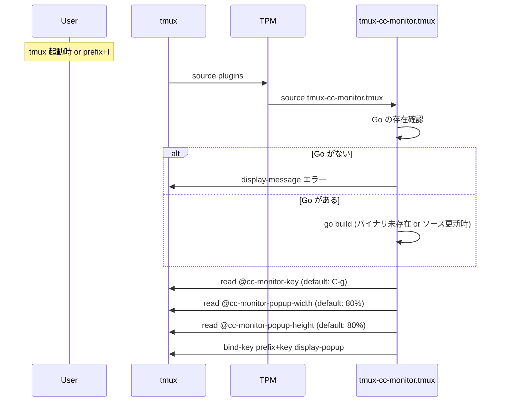

# tmux-cc-monitor TPM Support Design Doc

| 項目 | 内容 |
|---|---|
| Author | ch0wdreN |
| Reviewer | セルフレビュー |
| Status | Draft |
| Created | 2026-05-07 |
| Updated | 2026-05-07 |

---

## 1. 概要 (Overview)

tmux-cc-monitor を TPM (Tmux Plugin Manager) プラグインとしてインストールできるようにする。tmux.conf に `set -g @plugin 'ch0wdreN/tmux-cc-monitor'` と書いて `prefix + I` を押すだけで、ソースビルドからキーバインド設定まで完了する。Claude Code hooks の設定は引き続き手動。

## 2. 背景と目的 (Background & Motivation)

現在のインストールフローは以下の手順を要求する:

1. Go のインストール
2. `task` (go-task) のインストール
3. `task build && task install`
4. `~/.tmux.conf` にキーバインドを手書き
5. `~/.claude/settings.json` に hooks を手書き

このうち手順 2〜4 が TPM 対応で解消される。`task` コマンドへの依存がなくなり、tmux.conf を管理しているユーザーであれば TPM 経由のインストールだけで使い始められる。

Go の事前インストール（手順 1）と Claude Code hooks の設定（手順 5）は引き続き必要だが、これは本ツールの性質上避けられない前提条件であり、スコープ外とする。

## 3. スコープ (Scope)

### In Scope

- TPM プラグインエントリポイント（`tmux-cc-monitor.tmux` シェルスクリプト）の作成
- `prefix + I` 実行時の Go ソースビルド
- デフォルトキーバインド（`prefix + C-g`）の自動設定
- tmux ユーザーオプションによるカスタマイズ（キーバインド、ポップアップサイズ）
- Go 未インストール時のエラーメッセージ表示

### Out of Scope

- Claude Code hooks (`~/.claude/settings.json`) の自動注入・自動削除
- GitHub Releases によるプリビルドバイナリ配布
- `task build` / `task install` の廃止（開発フローとして引き続き利用可能）
- TPM 以外のプラグインマネージャ対応

## 4. 制約条件 (Constraints)

| 種別 | 内容 |
|---|---|
| 技術的制約 | Go がユーザー環境にインストール済みであること（ソースビルド方式のため） |
| 技術的制約 | TPM のプラグインプロトコルに準拠すること（リポジトリルートに `*.tmux` 実行可能スクリプト） |
| 技術的制約 | tmux 3.2 以上（`display-popup -E` が必要） |
| 互換性 | 既存の手動インストール（`task install` + 手書きキーバインド）と共存可能であること |

## 5. 受け入れ基準 (Acceptance Criteria)

- [ ] `set -g @plugin 'ch0wdreN/tmux-cc-monitor'` を tmux.conf に追記し `prefix + I` を実行すると、Go ソースからビルドされ `tmux-cc-monitor` バイナリが生成される
- [ ] ビルド完了後、`prefix + C-g` でポップアップ TUI が起動する
- [ ] `set -g @cc-monitor-key 'M-g'` のようにキーバインドを変更でき、変更後のキーで起動する
- [ ] `set -g @cc-monitor-popup-width '60%'` / `set -g @cc-monitor-popup-height '50%'` でポップアップサイズが変更される
- [ ] Go が未インストールの環境で `prefix + I` を実行した場合、tmux の `display-message` でエラーが表示されビルドがスキップされる
- [ ] `prefix + alt + u`（TPM アンインストール）でプラグインディレクトリが削除され、キーバインドが解除される
- [ ] 既存の `task build && task install` によるインストールが引き続き機能する

## 6. システム設計 (System Design)

### 6.1 TPM プラグインライフサイクル



### 6.2 ファイル構成

TPM 対応で追加・変更するファイル:

| ファイル | 役割 |
|---|---|
| `tmux-cc-monitor.tmux` | TPM エントリポイント。ビルド・キーバインド設定を行うシェルスクリプト（リポジトリルートに配置、実行権限付き） |
| `scripts/build.sh` | Go ビルドロジック。`tmux-cc-monitor.tmux` から呼び出される |

### 6.3 バイナリのビルドと配置

TPM はプラグインリポジトリを `~/.tmux/plugins/tmux-cc-monitor/` にクローンする。バイナリはこのディレクトリ内にビルドする:

```
~/.tmux/plugins/tmux-cc-monitor/
├── tmux-cc-monitor.tmux    # TPM エントリポイント
├── scripts/
│   └── build.sh            # ビルドスクリプト
├── bin/
│   └── tmux-cc-monitor     # ビルド済みバイナリ
├── cmd/                    # Go ソース
├── internal/               # Go ソース
└── ...
```

キーバインドではこのバイナリの絶対パスを使用する:

```bash
PLUGIN_DIR="$(cd "$(dirname "${BASH_SOURCE[0]}")" && pwd)"
BIN="$PLUGIN_DIR/bin/tmux-cc-monitor"
tmux bind-key "$key" display-popup -E -w "$width" -h "$height" "$BIN ui"
```

Claude Code hooks からもこのパスを参照する必要があるため、README にパス例を記載する。

### 6.4 ユーザーオプション

| オプション | デフォルト値 | 説明 |
|---|---|---|
| `@cc-monitor-key` | `C-g` | ポップアップ起動キー（prefix に続けて押すキー） |
| `@cc-monitor-popup-width` | `80%` | ポップアップの幅 |
| `@cc-monitor-popup-height` | `80%` | ポップアップの高さ |

tmux.conf での設定例:

```tmux
set -g @plugin 'ch0wdreN/tmux-cc-monitor'
set -g @cc-monitor-key 'M-g'
set -g @cc-monitor-popup-width '60%'
set -g @cc-monitor-popup-height '50%'
```

オプション読み取りは `tmux show-option -gqv` で行い、値が空ならデフォルトを使用する。

### 6.5 ビルド戦略

`scripts/build.sh` は以下のロジックで動作する:

1. `go` コマンドの存在確認。なければ `tmux display-message` でエラーを出して終了
2. `bin/tmux-cc-monitor` が存在しない、またはソースファイル（`cmd/`, `internal/`, `go.mod`, `go.sum`）よりタイムスタンプが古い場合にビルドを実行
3. `go build -o bin/tmux-cc-monitor ./cmd/tmux-cc-monitor/`
4. ビルド失敗時は `tmux display-message` でエラーを表示

タイムスタンプ比較は `find` + `-newer` で行い、毎回の tmux 起動で不要なビルドを避ける。

## 7. エラーハンドリング (Error Handling)

| ケース | 対応 |
|---|---|
| Go 未インストール | `tmux display-message "tmux-cc-monitor: 'go' command not found. Install Go to use this plugin."` |
| ビルド失敗 | `tmux display-message "tmux-cc-monitor: build failed. Check 'go build' output."` |
| tmux バージョン不足 | tmux 3.2 未満では `display-popup` が存在しないため、`tmux display-message` で警告（ただし積極的なバージョンチェックは行わない） |

## 8. 設計上の意思決定 (Design Decisions)

### Decision 1: ソースビルド方式を採用

| | 内容 |
|---|---|
| **決定事項** | TPM インストール時に `go build` でソースからビルドする |
| **理由** | リリースフロー（GitHub Releases へのバイナリアップロード、クロスコンパイル、アーカイブ管理）の構築・維持コストを避ける。個人ツールであり、作者自身の環境には Go が常にある |
| **検討した代替案** | GitHub Releases にプリビルドバイナリを配置し、TPM インストール時にダウンロードする方式 |
| **代替案を選ばなかった理由** | goreleaser 等のリリースパイプライン構築が必要になり、個人プロジェクトの規模に対してオーバーヘッドが大きい。ユーザーが増えた段階で再検討する |

### Decision 2: バイナリをプラグインディレクトリ内に配置

| | 内容 |
|---|---|
| **決定事項** | ビルド済みバイナリを `~/.tmux/plugins/tmux-cc-monitor/bin/` に配置する |
| **理由** | TPM のアンインストール（`prefix + alt + u`）でプラグインディレクトリごと削除されるため、バイナリも自動的にクリーンアップされる |
| **検討した代替案** | `~/.config/tmux-cc-monitor/bin/`（既存の `task install` と同じ場所）に配置 |
| **代替案を選ばなかった理由** | TPM アンインストール時にバイナリが残留する。また、`task install` と TPM で同じパスを共有すると、どちらがバイナリを管理しているか曖昧になる |

## 9. リスクと懸念事項 (Risks & Open Questions)

| リスク | 影響度 | 対応方針 |
|---|---|---|
| tmux 起動のたびにビルドチェックが走るオーバーヘッド | Low | タイムスタンプ比較のみで軽量。実際のビルドは初回とソース更新時のみ |
| Go のバージョン不一致でビルド失敗 | Low | `go.mod` の `go` ディレクティブに従い、Go 側がエラーを出す。追加のバージョンチェックは不要 |
| TPM 経由と `task install` 経由で 2 つのバイナリが共存 | Low | パスが異なるため実害なし。hooks が参照するパスでどちらを使うか決まる |
| hooks に記載するバイナリパスが TPM のインストール先に依存 | Med | README に `~/.tmux/plugins/tmux-cc-monitor/bin/tmux-cc-monitor` というデフォルトパスを明記する |

## 10. 実装計画 (Implementation Plan)

| フェーズ | 内容 | 成果物 |
|---|---|---|
| 1 | `scripts/build.sh` 作成 — Go 存在確認、タイムスタンプ比較、ビルド実行 | `scripts/build.sh` |
| 2 | `tmux-cc-monitor.tmux` 作成 — ビルド呼び出し、オプション読み取り、キーバインド設定 | `tmux-cc-monitor.tmux` |
| 3 | 動作検証 — TPM で実際にインストール・アンインストールし受け入れ基準を確認 | 手動テスト |
| 4 | README 更新 — TPM 経由のインストール手順、オプション一覧、hooks のパス例を追記 | `README.md` |

## 11. Related ADRs

- [TPM インストール時にソースビルド方式を採用する](../adr/20260507-adopt-source-build-for-tpm-install.md)
- [ビルド済みバイナリを TPM プラグインディレクトリ内に配置する](../adr/20260507-place-binary-inside-plugin-directory.md)

## 12. 参考資料 (References)

- [TPM (Tmux Plugin Manager)](https://github.com/tmux-plugins/tpm)
- [TPM: How to create a plugin](https://github.com/tmux-plugins/tpm/blob/master/docs/how_to_create_plugin.md)
- [tmux-cc-monitor v0.0.1 Design Doc](./20260506_tmux_cc_monitor_design.md)
